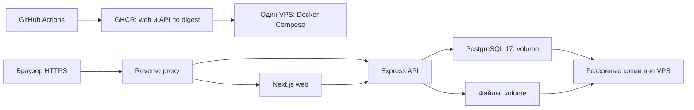

# Переезд bio-exam с Vercel и Supabase на один VPS

Дата проверки: 2026-09-26. Код: `ebf9e657f7444b2af354b9f58e34ad7d0d4406eb`, ветка `master`.
Статус: план подготовки. Инфраструктура и production не изменены.

## 1. Результат и границы

**Результат:** web, API, PostgreSQL и все прикладные файлы работают на одном VPS через Docker Compose. GitHub Actions проверяет код, собирает Docker-образы и выполняет воспроизводимый деплой. Для релиза и первоначального переноса есть проверенный откат. В плане выбран тариф Beget 4 vCPU / 6 GB RAM / 80 GB NVMe; Timeweb — исходный вариант сравнения. Сервер ещё не заказан.

**В scope:** зависимости от хостинга, база и миграции, Storage, авторизация, контейнеры, CI/CD, DNS/TLS, резервные копии, наблюдаемость, проверка переноса.

**Вне scope:** изменение бизнес-логики экзаменов, новый дизайн, полный аудит качества кода, перенос сторонних YouTube/Twitter embeds и реализация приёма фотографий домашних заданий. Будущие фотографии учитываются в расчёте диска. Этот документ не выполняет миграцию, покупку ресурсов, запись в production или действия с Git.

**Допущения:**

- **A1.** Требуется полный отказ от Vercel и Supabase в runtime. Основание: запрос «перенести всё». Опровергается решением сохранить один из этих сервисов.
- **A2.** Стартовая схема — один VPS с web, API, PostgreSQL и локальными файлами. Основание: пользователь попросил размещать всё вместе и отклонил избыточный запас ресурсов. Допущение опровергается изменением этого решения или измерением, которое показывает, что выбранный VPS не выдерживает требуемую нагрузку.
- **A3.** Подключения из `app/server/.env` и `app/web/.env` указывают на одну удалённую базу, а DB и Storage — на один проект Supabase. Источник содержит недавние попытки прохождения тестов. В локальном env указано `development`; совпадение с production env Vercel отдельно не проверено. Размеры ниже относятся к этому настроенному проекту.

**Критерии приёмки миграции:**

| ID  | Критерий                                       | Доказательство                                                                            |
| --- | ---------------------------------------------- | ----------------------------------------------------------------------------------------- |
| C1  | Нет обращений приложения к Vercel/Supabase     | Инвентаризация env и URL, логи API, сетевые запросы браузера и сверка конфигурации        |
| C2  | Данные и прикладные файлы перенесены полностью | Сверка таблиц, ключей, связей, sequences, истории миграций и манифеста объектов с SHA-256 |
| C3  | Основные пользовательские сценарии сохранены   | E2E через HTTPS, настоящий API, PostgreSQL и постоянное файловое хранилище                |
| C4  | Релиз воспроизводим и откатывается             | Проверенный digest образов, журнал deployment, пробный откат                              |
| C5  | Данные восстанавливаются после сбоя            | Успешное восстановление PostgreSQL и файлов в согласованное состояние                     |

Карта работ: инвентаризация закрывает C1/C2; подготовка приложения и Docker — C1/C3; перенос — C2; CI/CD — C4; резервирование — C5; репетиция и переключение подтверждают C1–C5.
Стоп текущей задачи: этот план готов, источники и ограничения проверки указаны.

## 2. Что есть в проекте

Проверены манифесты всех workspace, конфигурация деплоя, реализация базы, SQL-миграции, серверные границы и клиентские зависимости от провайдеров. Выполнен поиск env и интеграций по исходникам. Это инфраструктурный обзор всего репозитория, а не построчная проверка каждого UI-компонента.

| Область         | Реализация                                                                                  | Значение для переезда                                                          |
| --------------- | ------------------------------------------------------------------------------------------- | ------------------------------------------------------------------------------ |
| Монорепозиторий | Yarn `4.12.0`, Turborepo, Node `24`, `node-modules` linker                                  | Docker build context должен включать корень и workspace-пакеты                 |
| Web             | Next.js `^16.2.1`, React, SSR; корневой layout `force-dynamic`                              | Нужен Node runtime. Статическая выгрузка сайта не подходит                     |
| API             | Express, TypeScript → `dist`, `src/index.ts` запускает HTTP server                          | Есть обычная точка запуска вне Vercel                                          |
| Общий пакет     | `@bio-exam/rbac`, exports из `dist`                                                         | Собрать пакет до web/API и включить его runtime-файлы в образы                 |
| PostgreSQL      | `pg` + Drizzle; 25 таблиц в `schema.ts`                                                     | SQL и бизнес-данные переносим отдельно от файлов                               |
| Миграции        | 21 SQL-файл: `0000`–`0020`                                                                  | Нужен перенос фактической истории применения                                   |
| Авторизация     | bcrypt, JWT, cookies; `refresh_tokens`, роли и RBAC в своей базе                            | Supabase Auth в проверенном runtime не используется                            |
| Storage         | Серверный `StorageService` использует Supabase SDK                                          | Требуется локальная реализация всех используемых операций и постоянный volume  |
| Контент         | `prompt.md`, `explanation.md`, изображения, аватары, assets тестов, JSON для экспорта       | PostgreSQL dump сам по себе не содержит экзаменационные материалы              |
| Поиск           | `question_search_documents`, GIN, `pg_trgm`, вызовы `extensions.similarity(...)`            | Важны расширение, его схема, права и индексы                                   |
| Vercel          | Два `vercel.json`, serverless adapter API, build helpers                                    | Настроить альтернативный запуск; старые файлы сохранить до завершения переезда |
| Docker / CI     | Dockerfile, Compose и `.github/workflows` отсутствуют                                       | Конвейер и контейнеры нужно создать                                            |
| Проверки        | Есть 12 файлов существующих `.test.ts`; root `test`/`verify` и E2E-конфигурация отсутствуют | Не считать команды из старых планов существующим CI                            |

Версии выше взяты из манифестов, а не из production. Точные установленные версии нужно получить из `yarn.lock` при подготовке образов.

Опорные файлы: [package.json](../package.json), [API](../app/server/src/app.ts), [база](../app/server/src/db/index.ts), [схема](../app/server/src/db/schema.ts), [Storage](../app/server/src/services/storage/storage.ts), [Next.js](../app/web/next.config.ts).

### 2.1. Измерение живой базы и Storage — C2, выбор ресурсов

Замер: **2026-09-26 15:59:57 UTC**. Подключение к Supabase из env проекта. TLS проверен с Supabase CA. SQL выполнялся в `BEGIN TRANSACTION ISOLATION LEVEL REPEATABLE READ READ ONLY`, завершён `ROLLBACK`. Читались агрегаты и метаданные; фотографии и содержимое пользовательских ответов не скачивались. MB и GB ниже — десятичные единицы.

| Показатель                               | Точное значение                             |
| ---------------------------------------- | ------------------------------------------- |
| Пользователи                             | 31: 1 `admin`, 30 `user`                    |
| Активированные аккаунты учеников         | 19 из 30                                    |
| Ученики с попытками за последние 30 дней | 10; 36 попыток, только роль `user`          |
| Группы / темы                            | 3 / 7                                       |
| Тесты                                    | 63, опубликованы 48                         |
| Вопросы / черновики                      | 1834 / 0                                    |
| Попытки / сессии / назначения тестов     | 264 / 227 / 520                             |
| Ключи ответов / поисковые документы      | 3945 / 1834                                 |
| PostgreSQL                               | 17.6; вся база 31 517 843 байта = 31,52 MB  |
| Таблицы `public` с индексами             | 13 393 920 байт = 13,39 MB; часть всей базы |
| Бакеты                                   | Один закрытый бакет `main`                  |
| Все объекты Storage                      | 2691; 37 063 973 байта = 37,06 MB           |
| `prompt.md`                              | 1834 файла; 20 932 578 байт = 20,93 MB      |
| Изображения в `images/`                  | 788 WebP; 16 059 790 байт = 16,06 MB        |
| JSON                                     | 68 файлов; 71 605 байт                      |
| Прочее                                   | Один объект нулевого размера                |
| Самый большой отдельный объект           | 674 826 байт; `prompt.md`                   |
| Самое большое отдельное изображение      | 186 546 байт                                |

Размер указан у всех 2691 объектов; delete markers и архивных объектов нет. Все 1834 `questions.prompt_path` совпали с объектами бакета. Ссылок на объяснения и аватары в проверенных полях нет. Локальные каталоги uploads/md в проверенной рабочей копии отсутствуют; это не проверка файловой системы Vercel.

В живой схеме не найдено таблиц/колонок homework, submission, attachment или photo. В Storage есть только корневые префиксы `topics/` и `images/`. Отдельного учёта фотографий ДЗ сейчас нет; нельзя считать существующие иллюстрации присланными учениками фотографиями. Размеры текстов и изображений уже входят в сумму Storage. База вместе с файлами занимает около **68,58 MB**; это не размер ОС, Docker, WAL или будущих резервных копий.

Полезные запросы для повторного замера на том же источнике:

```sql
BEGIN TRANSACTION ISOLATION LEVEL REPEATABLE READ READ ONLY;
SELECT current_setting('server_version'), pg_database_size(current_database());
SELECT r.role_key, count(DISTINCT r.user_id),
       count(DISTINCT r.user_id) FILTER (WHERE u.is_active)
FROM public.user_roles r JOIN public.users u ON u.id = r.user_id
GROUP BY r.role_key;
SELECT bucket_id, count(*), sum((metadata->>'size')::bigint)
FROM storage.objects GROUP BY bucket_id;
SELECT metadata->>'mimetype' AS mime, count(*),
       sum((metadata->>'size')::bigint)
FROM storage.objects GROUP BY mime;
ROLLBACK;
```

Перед приведением `size` к bigint проверить отсутствие NULL и значений, не соответствующих `^[0-9]+$`; в текущем замере таких объектов нет. Сверка hashes и настоящий restore пока не выполнялись.

### Ограничения графа

GitNexus обновлён через `node .gitnexus/run.cjs analyze --index-only`. Индекс соответствует проверенному коммиту: 5940 узлов, 12940 связей, 293 потока. Анализатор сообщил ограничения обхода: часть entry points и callees не включена. Отсутствие потока не доказывает отсутствие зависимости.

`impact StorageService` вернул LOW и 6 связанных узлов, включая assets, avatar и backfill поиска. `impact storageService` вернул UNKNOWN: обращения к singleton не разрешены графом. Поиск по исходникам подтвердил дополнительные потребители в `routes/tests/index.ts` и `routes/tests/public.ts`. Поэтому перенос Storage имеет существенный прикладной риск: затрагивает просмотр вопросов, редактирование, перенос между тестами и ZIP-экспорт. UNKNOWN не трактуется как безопасная замена.

## 3. Обязательная подготовка приложения

### 3.1. PostgreSQL и миграции — C2/C3

1. Снять read-only инвентаризацию production: версия PostgreSQL, размер базы, реальные таблицы и схемы, extensions, владельцы, роли, policies, функции, triggers, sequences и дополнительные задания. Сравнить с репозиторием.
2. Проверить `public.__drizzle_migrations`. Текущий runner явно задаёт `migrationsSchema: 'public'`. Перенос этой таблицы обязателен; нельзя просто запустить все миграции повторно поверх восстановленной схемы.
3. Восстановить непрерывность Drizzle metadata на проверочной базе. Journal достигает `0020`, последний snapshot — `0015`; snapshots существуют только для `0000`, `0001`, `0015`. Не переписывать уже применённый SQL. Старый [план 009](009-drizzle-metadata.md) подтверждает риск, но его статус и команды не являются доказательством исправления.
4. Проверить миграции с нуля и обновление восстановленной базы отдельно. Переносить production по фактической схеме, а не по предположению, что journal уже полностью применён.
5. На PostgreSQL 17 целевого VPS подготовить `pg_trgm` в схеме `extensions`. `0017` создаёт расширение и GIN-индекс; `0018` переносит расширение. Проверить роли владельца расширения, вызов `extensions.similarity` и восстановление индексов.
6. Настроить отдельные роли владельца/мигратора и API. Роль API получает необходимые DML-права, доступ к sequences и функциям, но не DDL. Bootstrap роли выполнить явно перед restore; не использовать административную роль PostgreSQL в runtime API.
7. Согласовать RLS с ролью API. `0018` включает RLS и policy `deny_direct_access` с `USING(false)` / `WITH CHECK(false)` для `public`. Простые GRANT не открывают доступ через такую policy. Предпочтение: явные политики для серверной роли API при сохранении запрета прочим ролям. Не выдавать API superuser для обхода ошибки. Владельцы и BYPASSRLS имеют отдельную семантику. [PostgreSQL RLS](https://www.postgresql.org/docs/current/ddl-rowsecurity.html).
8. Подключать API и migration runner к PostgreSQL через внутреннюю Docker network. Не публиковать порт БД в интернет. Убрать зависимость выбора параметров соединения от hostname Supabase; TLS внешних соединений проверять с CA источника. Проверить подключение API и migration runner в целевой схеме.
9. Пересчитать connection budget: сумма `PG_POOL_MAX` API, возможного web-пула, migration jobs и резерв для эксплуатации должна помещаться в настроенный лимит PostgreSQL и память одного VPS.

### 3.2. Storage — C1/C2/C3

Сохранить внешний контракт сервиса и API. Заменить Supabase-вызовы локальным файловым provider-модулем. Перечень операций: чтение текста и Buffer, запись/upsert с MIME и Cache-Control, список, рекурсивный обход, метаданные, ссылки с проверкой доступа, копирование/перенос префикса, удаление через существующий пользовательский API и ZIP-экспорт. Данные лежат в постоянном volume, вне образов контейнера.

Важные различия:

- Текущие списки Supabase не везде обходят все страницы. Для переноса нужен полный manifest всех 2691 объектов; текущий `listFilesRecursive` не доказывает полноту backup.
- Сохранить контракт медиатеки: pagination, порядок, MIME и нужные метаданные. Не вводить новую таблицу без конкретной необходимости.
- Перенос «директории» — copy объектов с проверкой и только затем удаление источников. Миграционное копирование должно быть неразрушающим. Сам план не разрешает удалять данные источника.
- При замене signed URL на прикладной маршрут согласовать подпись, TTL и cacheNonce. Не переносить формат подписи Supabase в новый обработчик.
- Срок клиентского кеша signed URL сейчас 50 минут. Согласовать его с TTL новых ссылок и учитывать время переноса страницы/долгого экзамена.
- Нельзя заменять hostname в уже подписанном URL. Существующие ссылки преобразовать в key/прикладной URL.
- Сохранить key, MIME, Cache-Control и нужные метаданные. ETag не является универсальным SHA-256, особенно для multipart.
- Содержимое вопросов, объяснения, `answer_keys.json` и будущие фотографии ДЗ хранить приватно. Доступ выдаёт API с проверкой прав. Не открывать весь каталог через статическую раздачу. Проверить, что key не позволяет выйти за корень хранилища через path traversal или symlink.

S3 остаётся возможным отдельным вариантом при росте объёма. Для стартового размещения контента на VPS отдельный S3 или MinIO не нужен.

### 3.3. Ссылки на файлы — C1/C2/C3

Инвентаризировать ссылки в `users.avatar`, `users.avatar_cropped`, вопросах, markdown/MDX, JSON редактора и `question_drafts.payload`. В базе `questions.prompt_path` и `explanation_path` обычно содержат key, который нужно сохранить.

Существуют абсолютные Supabase URL и клиентский parser `/storage/v1/object/public|sign/...`. При отключении источника такие ссылки нельзя оставлять как внешние адреса. Подготовить отображение старый URL → key/новый прикладной URL. Обрабатывать известные поля и форматы; не выполнять глобальную замену произвольного текста.

Проверить чтение и повторную загрузку аватара: удаление прежнего аватара тоже извлекает key из Supabase URL. Перенести original и cropped версии, параметры crop и связанные ключи. Обновление ссылок выполнить до финальной сверки данных. Сохранять манифест преобразований для отката.

### 3.4. Авторизация и граница web/API — C1/C3

- Сохранить пользователей, password hashes, приглашения, роли, grants и refresh-токены. Seed и bootstrap-admin не запускать поверх перенесённой базы автоматически.
- При сохранении домена и `AUTH_JWT_SECRET` сессии могут продолжить работать. При изменении секрета или домена спланировать повторный вход. Это проверяется отдельным сценарием; сохранение сессий пока не доказано.
- `getServerMe` уже обращается к `API_ORIGIN`, но содержит fallback к прямой базе. В Next также остаётся `/api/auth/me` с `getMeData` и собственным `pg`-пулом. Свести production-авторизацию к Express API. Web должен запускаться без `DATABASE_URL` и JWT signing secret; старые файлы можно сохранить без подключения к production.
- Сохранить маршруты `/api/*`, cookie names, HttpOnly, Secure и SameSite. Предпочтение — один публичный origin для сайта и API.
- `app.set('trust proxy', 1)` проверить для фактической цепочки proxy. Proxy должен перезаписывать forwarded headers. Нельзя принимать подставленный клиентом IP как доверенный.

### 3.5. Запуск и runtime — C3/C4

- API запускать через `node --enable-source-maps dist/index.js`, без serverless adapter.
- Исправить graceful shutdown: сейчас `server.close()` не ожидается, а `pgPool.end()` начинается сразу. Дождаться активных HTTP-запросов перед закрытием пула, задать конечный timeout и согласовать `stop_grace_period`.
- Разделить liveness и readiness. `/healthz` уже существует; `/healthz/db` раскрывает детали соединения и версии. Для публичного readiness возвращать минимум данных; диагностику базы ограничить внутренней сетью.
- Существующие локальные fallback пишут в `../web/public/uploads`, а production-раздача `/uploads` выключена. Простое удаление Supabase env сломает доступ к файлам. Для выбранного VPS нужен явный storage root в постоянном volume и проверенный обработчик доступа.
- Хранить временные файлы в ограниченном `/tmp`. Проверить ZIP-экспорт: текущая реализация собирает Buffer в памяти. Измерить самый большой реальный экспорт и подобрать лимиты; streaming добавлять при подтверждённой необходимости.
- Rate limiter хранит счётчики в памяти процесса. Для одновременных реплик нужен общий предел: на едином ingress или в общем store. Не считать сумму независимых лимитов прежней защитой. Redis/Valkey добавлять только при выбранном варианте общего store.
- В проверенном API не найден отдельный worker, cron, Supabase Realtime, Edge Functions или SMTP. Задания и функции, созданные в панели провайдера, остаются пунктом production-инвентаризации. `DOCS_ROOT` сам по себе не доказывает работающий файловый сервис.

## 4. Целевая схема

**Рекомендация для текущего проекта:** один VPS для proxy, web, API, PostgreSQL и файлов. Постоянные данные лежат в volumes; образы приложения заменяются при релизе. GitHub остаётся источником кода и CI/CD.



Proxy обслуживает один домен: `/api/*` → API, страницы и Next static → web. `/uploads/*` включать только после проверки legacy-ссылок и определения безопасного обработчика. Публичны 80/443 и управляемый SSH-доступ. Порты web/API/БД не открывать напрямую. Для внутренних связей использовать Docker network.

Выбранный старт: **один VPS 4 vCPU / 6 GB RAM / 80 GB NVMe**, сборка образов в GitHub Actions. Основание — решение пользователя взять этот тариф с запасом для всех сервисов и будущих фотографий ДЗ. 6 GB RAM — общая память Linux, Docker, Next.js, Express, PostgreSQL и файлового кеша. Это на 2 GB больше предыдущего варианта; 4 GB не признаны недостаточными по замерам. Настроить лимиты контейнеров и PostgreSQL pool с запасом для ОС после измерения расхода памяти. Основание для текущего объёма данных — около 68,58 MB БД и файлов; место также занимают ОС, образы Docker, WAL, логи и временные данные. Память и пиковая нагрузка ещё не измерены; перед переключением проверить ожидаемый экзамен, autosave и экспорт. Стартовый деплой последовательно пересоздаёт web/API и допускает короткую недоступность; постоянный второй слот не нужен.

### Проверенные тарифы и стартовый бюджет

Цены повторно проверены 2026-09-26. Выбран фиксированный тариф Beget в Санкт-Петербурге: 4 vCPU / 6 GB / 80 GB NVMe — 68 ₽/день, IPv4 — 5 ₽/день. Итого 73 ₽/день: **2190 ₽ за 30 дней**, **2263 ₽ за 31 день**. База и прикладные файлы работают на этой же машине, отдельных DBaaS/S3 в стартовом бюджете нет. Хранение независимых резервных копий рассчитывается отдельно. [Тариф VPS Beget](https://beget.com/ru/vps).

Для исходного варианта Timeweb Cloud-50: 2 vCPU / 4 GB / 50 GB NVMe с IPv4 — 1200 ₽/месяц, Premium 3.3 GHz, Санкт-Петербург, помесячная оплата без годовой скидки. Это вариант сравнения, не принятое решение о провайдере. [Тариф VPS Timeweb](https://timeweb.cloud/services/vds-vps).

### Будущие фотографии домашних заданий

Текущее число учеников — 30 аккаунтов. Частота загрузок и размер фотографии пока неизвестны. Сценарии ниже не являются прогнозом фактической нагрузки:

| Фотографии на ученика за неделю | Размер одной | Новые данные за 52 недели |
| ------------------------------- | ------------ | ------------------------- |
| 5                               | 1 MB         | 7,8 GB                    |
| 5                               | 5 MB         | 39 GB                     |
| 10                              | 1 MB         | 15,6 GB                   |
| 10                              | 5 MB         | 78 GB                     |

Формула: ученики × фотографии за неделю × средний размер × 52. Для каждого дополнительного ученика расход растёт пропорционально. Формат/сжатие и срок хранения уточнить при реализации ДЗ; чтение рукописного текста должно оставаться удобным. Выбранные 80 GB учитывают запас по решению пользователя. Из этого объёма часть займут ОС, Docker, WAL и логи; все 80 GB нельзя считать местом для фотографий. Последующее увеличение диска планировать по фактическому свободному месту и темпу загрузок.

### Современные варианты деплоя

| Вариант                                    | Когда подходит                                                          | Решение для bio-exam                                                                     |
| ------------------------------------------ | ----------------------------------------------------------------------- | ---------------------------------------------------------------------------------------- |
| Docker Compose + GitHub Actions + registry | Небольшое число сервисов, нужен явный контроль запуска и отката         | Базовый рекомендуемый вариант                                                            |
| Kamal                                      | Нужен готовый инструмент управления контейнерными релизами на VPS       | Альтернатива собственным deploy scripts; проверить управление web/API как одним релизом  |
| Coolify                                    | Нужны UI, интеграция с Git и самостоятельная PaaS на VPS                | Альтернатива ручной эксплуатации Compose; добавляет отдельную платформу для обслуживания |
| Timeweb App Platform                       | Нужен managed запуск приложений                                         | Не соответствует выбранной схеме базы и файлов в локальных volumes                       |
| Kubernetes + Helm + Argo CD                | Нужны несколько узлов, системное масштабирование и декларативный GitOps | Оснований выбирать для первого переезда пока нет                                         |

Это альтернативные владельцы CD, а не компоненты, которые нужно устанавливать одновременно. Источники: [Kamal](https://kamal-deploy.org/docs/installation/), [Coolify](https://coolify.io/docs/), [Argo CD](https://argo-cd.readthedocs.io/en/stable/).

У App Platform Compose запрещены `volumes`, внешний proxy настраивается для первого сервиса, 80/443 зарезервированы. Поэтому PostgreSQL и постоянные файлы нельзя проектировать как обычный Compose stack с volumes на этой площадке. Автодеплой по push должен зависеть от успешного CI; нельзя иметь два независимых пути выпуска production. [Ограничения App Platform](https://timeweb.cloud/docs/apps/deploying-with-docker-compose).

Стратегии выпуска отличаются от способа хостинга: обычный recreate допускает перерыв; blue-green запускает новый слот до переключения; rolling обновляет реплики; canary переводит долю трафика и требует метрик. Для стартового VPS выбран recreate web/API с healthcheck и откатом по предыдущему digest. PostgreSQL и файловый volume при обычном релизе приложения не пересоздаются. Более сложная стратегия нужна только при отдельном требовании к простою.

## 5. Docker — C1/C3/C4

1. Создать отдельные multi-stage Dockerfile для web и API. Использовать Linux Node 24 с закреплённой базой, non-root runtime и фиксированной архитектурой VPS. Проверить `sharp` и другие native modules в Linux-образе.
2. Выполнять `yarn install --immutable`. Основной lockfile — `yarn.lock`; `package-lock.json` сохранить, но не смешивать package managers при сборке. Учитывать `.yarnrc.yml`, `yarnPath` и файл Yarn из `.yarn/releases`.
3. Сначала собрать `@bio-exam/rbac`, затем web/API. В runtime API включить compiled code, нужные production dependencies и собранный workspace-пакет.
4. Для web включить `output: 'standalone'` и monorepo tracing root. Включить `public`, `.next/static` и workspace outputs. Путь запуска standalone server проверить по фактическому build output. [Next output](https://nextjs.org/docs/app/api-reference/config/next-config-js/output).
5. Сделать отдельный migration target/job с Drizzle runner, SQL, journal и необходимым runtime. Сейчас команда использует `tsx` из devDependencies, а каталог миграций зависит от cwd. Не рассчитывать, что production API image автоматически содержит всё для миграций.
6. Не запускать `turbo start` в runtime: root start зависит от build. Контейнер запускает уже собранный артефакт напрямую.
7. Исключить `.env*`, `.git`, локальные uploads и build cache из Docker context. `.env.example` можно включать только как безопасный шаблон. Текущая загрузка dotenv использует `override: true`; скопированный `.env` переопределит runtime env.
8. Разделить build/runtime env. `API_ORIGIN` влияет на Next rewrites при сборке; `NEXT_PUBLIC_*` встраиваются в клиент. Предпочтение: внешний proxy владеет production `/api`, внутренний `API_ORIGIN` читается сервером при запуске. Один digest должен работать в staging и production без пересборки. Учитывать env в Turbo cache либо исключить небезопасное переиспользование кеша.
9. `next/font/google` требует сети при сборке. Проверить доступность в CI. Если недоступность воспроизводится, включить локальные файлы шрифтов в образ; не менять типографику произвольно.
10. Добавить healthchecks, ограничения памяти, restart policy, log rotation и writable `/tmp`. TLS-state proxy хранить постоянно на VPS. База и пользовательские файлы не лежат в слоях контейнера.
11. Для нескольких релизов Next проверить `deploymentId`, старые JS/CSS chunks и поведение уже открытой страницы. Сохранять необходимые старые assets на период перехода. В коде сейчас не найдены Server Actions; не вводить для них отдельный ключ без нового основания. [Next self-hosting](https://nextjs.org/docs/app/guides/self-hosting).

## 6. GitHub CI/CD — C3/C4

### CI на pull request

- Checkout → Node 24 / Yarn 4.12.0 → immutable install.
- Сборка RBAC → typecheck → web lint → сборка web/API.
- E2E на синтетических данных через публичный интерфейс реального приложения. Production credentials и production data не используются.
- Проверка миграций с нуля и совместимости обновления. Это проверка схемы и migration tooling, а не новая изолированная functional test suite.
- Проверка Docker build, зависимостей образа и отсутствия секретов в context/layers. Существующие тесты сохранить. Не придумывать root `yarn verify` без реализации.

### CD после merge в `master`

1. Собрать образы один раз на GitHub runner. Проставить commit SHA и OCI labels; опубликовать в GHCR. Сохранить digest web/API и версия migration job как единый release manifest. [Публикация Docker images](https://docs.github.com/en/actions/tutorials/publish-packages/publish-docker-images).
2. Проверить уязвимости образов; сохранять SBOM/provenance там, где доступны выбранному registry и GitHub plan. Закреплять Actions по commit SHA и выдавать минимальные permissions.
3. Проверить digest на стенде CI с синтетической базой и файловым volume: readiness и необходимые E2E. Продвигать в production тот же артефакт. Отдельный постоянный staging VPS не включать в стартовый бюджет.
4. Выпуск production привязать к GitHub Environment. Перед первым включением автоматического выпуска выбрать режим: ручное продвижение проверенного релиза либо автодеплой после всех gates. Рекомендуется ручное продвижение на период миграции. Доступность protection rules зависит от плана GitHub. [Управление deployment](https://docs.github.com/en/actions/how-tos/deploy/configure-and-manage-deployments/control-deployments).
5. Сериализовать production deploy. Не прерывать текущую миграцию отменой workflow. Добавить server lock, чтобы ручной и автоматический запуск не конфликтовали.
6. Запустить совместимую миграцию отдельной задачей. Стратегия expand-contract: старый и новый API должны работать на схеме во время переключения. Разрушающие изменения не включать в автоматический релиз переезда.
7. Скачать закреплённые образы и последовательно пересоздать web/API через Compose. Проверить healthcheck и критичный smoke. Сохранить предыдущий release manifest для отката; volumes базы и файлов не менять.
8. Если проверка нового релиза не прошла, запустить предыдущие digest web/API при совместимой схеме. Не выполнять автоматический downgrade базы.

Deploy с GitHub-hosted runner выполняется через ограниченный SSH-доступ и фиксированную серверную команду либо отдельный CD-agent. Не запускать недоверенный PR-код на production runner. Доступ к Docker daemon фактически привилегирован; одной группой `docker` безопасное разделение полномочий не достигается. Настроить узкий wrapper/учётную запись и хранить SSH host fingerprint. Проверить pull приватных GHCR images с VPS; runtime token — только на чтение.

Секреты runtime хранить отдельно от образа и репозитория. API нужны `DATABASE_URL`, `AUTH_JWT_SECRET`, настройки cookies, CORS и pool; storage root задаётся отдельно. Migration job использует отдельные DB credentials. Web нужны внутренний `API_ORIGIN`, origin и cookie name после устранения прямой базы. CI publish использует `GITHUB_TOKEN`; deploy — отдельную учётную запись. OIDC применять только при подтверждённой поддержке доверия выбранным сервисом; не считать его готовой заменой SSH. BuildKit secrets использовать для необходимых секретов сборки, а не `ARG`/`ENV`. [Docker build secrets](https://docs.docker.com/build/building/secrets/).

## 7. Перенос данных и переключение — C1/C2/C3/C4

### До окна переноса

1. Экспортировать безопасный перечень Vercel env, domains, redirects, DNS, scheduled jobs и настроек Supabase. Значения секретов переносить защищённым способом без логирования.
2. Получить полную инвентаризацию БД и всех бакетов. Для каждого объекта зафиксировать bucket, key, bytes, MIME, нужные metadata и SHA-256. Найти локальные production uploads, если они существуют вне Storage. В Git пользовательские uploads и каталог `md/` не хранятся.
3. Проверить связи DB → Storage и ссылки внутри markdown/JSON. Отдельно классифицировать orphan objects и неучтённые таблицы. Полный перенос не означает копировать только 25 объявленных таблиц, если production содержит дополнительные прикладные данные.
4. Подготовить целевую схему и роли. Получить selective logical dump прикладных объектов с фактическими dependencies и историей Drizzle. Не копировать вслепую системные схемы Supabase `auth`, `storage`, `realtime`, служебные роли и grants. Их прикладное использование сначала проверить.
5. Выбрать формат dump/restore после проверки ownership и extensions: например custom-format `pg_dump` и `pg_restore --no-owner --no-privileges --exit-on-error` с подготовленными ролями. Фильтры схем требуют явного учёта зависимостей. Клиент pg_dump должен поддерживать версию источника; target не должен быть старее источника без отдельной проверки. Не совмещать переезд с непроверенным major upgrade. [pg_dump](https://www.postgresql.org/docs/current/app-pgdump.html).
6. Сделать первичную копию файлов без удаления источников. PostgreSQL backups содержат Storage metadata, но не сами объекты Storage. [Supabase backups](https://supabase.com/docs/guides/platform/backups).
7. Провести полный пробный restore и измерить export/restore/copy/verification. По этим данным определить длительность maintenance window. Репликация/CDC не входит в стартовую схему; пересматривать это решение только если измеренное окно неприемлемо.
8. Проверить новый stack на отдельном hostname, включая HTTPS, RBAC и SSR. Понизить DNS TTL заблаговременно. DNS propagation не использовать как механизм мгновенного запрета записи.

### Окно переноса

1. Закрыть новые экзаменационные сессии. Дать активным попыткам завершиться либо согласовать перенос их текущих draft answers, telemetry и таймеров. Не обрывать попытки неожиданным переключением.
2. Включить maintenance на старом и новом публичном входе. Запретить прикладные записи в БД и Storage, остановить внешние writers и дождаться завершения текущих операций. UI-баннера недостаточно.
3. Зафиксировать точку переноса, release manifest и восстановимый backup источника. Снять финальный dump и финальный object manifest после остановки записи. Обновить копию изменившихся объектов; устаревшие объекты на target только классифицировать, без неразрешённого удаления.
4. Восстановить финальную базу в заранее подготовленный target, применить проверенное преобразование ссылок. Сверить row counts, UUID, ключевые aggregate fingerprints, FK, sequences, history, индексы и policies. Учесть ожидаемые различия от URL-преобразования.
5. Сверить все переносимые объекты по key, bytes и SHA-256. Проверить отсутствие битых ссылок на prompt/explanation, изображения и аватары. Данные и файлы должны отражать одну остановленную точку записи.
6. Переключить домен на выбранный VPS и проверить HTTPS, readiness, вход, открытие теста, сохранение попытки, Storage и экспорт. До разрешения production-записи сверка C2 и критические проверки должны пройти.
7. Разрешить запись только на target. Старый backend остаётся закрытым для записи даже для клиентов со старым DNS cache. Наблюдать ошибки и connections. Сохранять source backup и инфраструктуру до успешной проверки восстановления и отдельного решения об отключении.

### Откат

- **Обычный релиз:** вернуть предыдущие web/API digest и proxy-конфигурацию при совместимой схеме. Данные остаются в текущей базе.
- **Первоначальный переезд до новых записей:** вернуть старый вход, отключить target writers, восстановить прежний режим работы. Проверить, что источники не менялись.
- **Переезд после новых записей:** одного возврата DNS недостаточно. Сначала снова остановить запись и перенести изменения БД и Storage обратно либо исправить target. Без этой процедуры потеряются новые попытки и файлы. Правила reverse transfer должны быть проверены до разрешения первых записей; иначе допустим только forward recovery.

## 8. Наблюдаемость и резервные копии — C4/C5

- Контролировать HTTPS-доступность, readiness, долю 5xx, latency API, CPU/RAM/disk VPS, DB connections, failed migrations и ошибки файлового хранилища. Сначала использовать Pino/stdout и метрики провайдера. Добавлять отдельный monitoring stack только для отсутствующих нужных сигналов.
- Не писать cookies, токены, DB credentials и экзаменационные ответы в логи. Настроить redaction до публикации централизованных request logs.
- Начальная схема резервирования: ежедневный `pg_dump` и копия файлов во внешнее хранилище с ограниченным доступом. Снимок диска или копирование работающего PGDATA не заменяет проверенный backup PostgreSQL. Согласовать срок хранения копий и допустимую потерю данных между ними; PITR не включать без отдельного требования.
- Сохранять manifest файлов и проверять согласованность с восстановленной БД. Volumes защищают данные при замене контейнера, но резервной копией не являются.
- Проверить восстановление на синтетическом сценарии и измерить время. Записать дату точки восстановления, ожидаемые/полученные rows и object hashes, статус и команду повторения без секретов.

## 9. Этапы выполнения и будущие изменения

Записываемый в текущей задаче файл: только `plans/beget-migration.md`. Ниже — предлагаемый write set реализации. Перед изменением функций обязателен актуальный `codegraph impact`. Новые имена файлов обозначают предложения, а не существующие артефакты.

| Этап                            | Файлы / владелец модуля                                                                                                                                                                                                                                                                                                   | Критерии и проверка выхода                                                                                |
| ------------------------------- | ------------------------------------------------------------------------------------------------------------------------------------------------------------------------------------------------------------------------------------------------------------------------------------------------------------------------- | --------------------------------------------------------------------------------------------------------- |
| 0. Production inventory         | Infrastructure, DB, Storage; защищённый manifest вне публичного Git                                                                                                                                                                                                                                                       | C1/C2: размеры, версии, все writers, объекты и secrets перечислены                                        |
| 1. База и миграции              | `app/server/src/db/index.ts`, `src/scripts/apply-migration.ts`, `drizzle/meta/*`; новые SQL только при доказанной необходимости                                                                                                                                                                                           | C2/C3: replay и restore проходят; RLS, TLS и migration history проверены                                  |
| 2. Локальное хранилище и ссылки | `app/server/src/services/storage/storage.ts`, новые provider-файлы рядом; `src/routes/users/avatar.ts`, `src/routes/docs/assets.ts`; `app/web/lib/image-signed-url-cache.ts`, при необходимости `components/editor/editor-ui/image-component.tsx`                                                                         | C1/C2/C3: прежние storage/API signatures сохранены; полный manifest совпадает; старый контент открывается |
| 3. Web/API runtime              | `app/web/lib/auth/getServerMe.ts`, `app/web/app/api/auth/me/route.ts`, `app/web/lib/auth/server/getMeData.ts`, `app/web/lib/env/server.ts`, `app/web/next.config.ts`; `app/server/src/index.ts`, `app/server/src/app.ts`, `app/server/src/routes/db/health.ts`, `app/server/src/config/env.ts`, `app/server/.env.example` | C1/C3: web без DB-secret; HTTPS/cookies; readiness; корректное завершение запросов                        |
| 4. Контейнеры                   | Новые `app/web/Dockerfile`, `app/server/Dockerfile`, `.dockerignore`, `compose.yaml`, proxy-конфигурация в `deploy/`; package scripts / `turbo.json` только если нужны сборке                                                                                                                                             | C3/C4: Linux images запускаются из digest; миграционный job работоспособен                                |
| 5. CI/CD                        | Новые `.github/workflows/ci.yml`, `.github/workflows/deploy.yml`, ограниченные scripts в `deploy/`                                                                                                                                                                                                                        | C3/C4: PR gate, staging, продвижение digest, сериализация и откат проверены                               |
| 6. Сквозные проверки            | Новая минимальная E2E-конфигурация и устойчивые пользовательские journeys; безопасный fixture bootstrap                                                                                                                                                                                                                   | C3: сценарии из следующего раздела проходят на реальной persistence path                                  |
| 7. Репетиция и cutover          | Infrastructure / migration tooling; runbook и release/object manifests                                                                                                                                                                                                                                                    | C1–C5: измеренный перенос, сверка, rollback, restore                                                      |

Существующие Vercel-файлы, `package-lock.json`, старые тесты и legacy-файлы не удалять в рамках подготовки. Изменения в больших route-модулях минимизировать сохранением storage signatures. Новые/изменяемые source-файлы должны выполнять локальные quality gates; например текущий Storage файл имеет 566 строк, поэтому provider-границу нужно выделить содержательно. Это не основание для общего рефакторинга проекта.

До объявления реализации готовой применить `simplify` к собственному diff. Если меняется branching — выполнить локальные complexity checks. Соблюдать пороги проекта и типобезопасность; проверка качества текущего кода не выполнялась в этой planning-only задаче.

## 10. Сквозная проверка — C3/C4/C5

Новые автоматизированные functional tests должны проходить через публичный интерфейс, настоящие API/DB и файловый volume. Сначала записать journey и ожидаемый результат, затем реализовать поведение. Существующих E2E journeys в репозитории не найдено.

| Journey / failure mode                                                                | Ожидаемый наблюдаемый результат                                                                                    |
| ------------------------------------------------------------------------------------- | ------------------------------------------------------------------------------------------------------------------ |
| Вход → SSR профиль → refresh → logout; неверный пароль и истёкшая сессия              | Профиль одинаков на клиенте/сервере; cookies работают через HTTPS; неверный вход отклонён; logout закрывает сессию |
| Admin/student, роль изменена, прямой запрос закрытого действия                        | Существующие разрешения сохранены; сервер не отдаёт чужие/закрытые данные                                          |
| Открытие старого вопроса с markdown/MDX и изображением; отсутствующий/закрытый объект | Контент полный; старые ссылки преобразованы; ошибка видна, закрытый объект не раскрыт                              |
| Загрузка/обновление изображения и original/cropped аватара; ошибка записи файла       | Файл виден после перезапуска; неуспешное сохранение не сообщается как успешное                                     |
| Создание/редактирование вопроса → перенос между тестами → ZIP без/с ответами          | prompt/explanation и keys согласованы; роли определяют доступ к ответам; ZIP содержит ожидаемые файлы              |
| Экзамен → ответы/telemetry → перезагрузка → submit; повторный submit                  | Draft и таймер сохраняются; итог соответствует сохранённым данным; нет лишней попытки                              |
| Поиск текста вопроса и нечёткий поиск                                                 | Ожидаемые результаты доступны разрешённой роли; `pg_trgm` и search documents работают                              |
| Релиз с открытым экзаменом/редактором; неготовый новый контейнер; возврат релиза      | Активные данные сохранены; JS/CSS доступны; ошибка readiness приводит к откату; возврат проверен                   |
| Недоступность БД/файлов и восстановление                                              | Readiness/ошибка соответствуют сбою; нет ложного успеха; восстановленные данные/файлы проходят сверку              |

Для каждого run сохранять commit/diff fingerprint, digest, journey/fixture, expected/observed, exit status и rerun command. Не сохранять production content или секреты в CI artifacts. Сценарии переноса выполнять на синтетической либо специально разрешённой копии данных.

Будущие базовые статические команды из корня: `yarn install --immutable`, `yarn workspace @bio-exam/rbac build`, `yarn typecheck`, `yarn workspace @bio-exam/web lint`, `yarn build`. Они здесь не запускались. Docker/E2E/migration команды зафиксировать после появления соответствующих файлов; отсутствующая команда не считается gate.

## 11. Что ещё нужно узнать до реализации

- Production domains и управление DNS; нужно ли сохранить текущий origin.
- Совпадение проверенного проекта с production env Vercel, максимальный ZIP, пиковая CPU/RAM-нагрузка и число одновременных экзаменов. Размеры настроенного Supabase уже измерены в разделе 2.1.
- Средний размер будущей фотографии ДЗ, частота загрузок, рост числа учеников и срок хранения.
- Приемлемое окно запрета записи, порядок завершения активных экзаменов, RPO/RTO.
- Доступ к выбранному VPS Beget 4/6/80 и место для независимых резервных копий.
- Настройки GitHub: private/public repo, доступность Environment rules, право публикации GHCR.
- Политика продвижения production и владелец эксплуатации после переезда.

Эти данные не блокируют составление плана. Они блокируют окончательный выбор ресурсов и необратимое переключение. Стартовые тарифы проверены выше; сроки реализации и окончательный бюджет не оценены без размеров, нагрузки и допустимого окна.

## 12. Доказательства текущего обзора

- При первоначальном обзоре working tree был чистый. Позднее выполнена read-only инвентаризация настроенного Supabase: SQL-агрегаты, размеры всех Storage objects, роли, число попыток и сверка prompt refs. Настройки кабинетов Vercel и восстановление не проверены. Источник и границы замера указаны в разделе 2.1.
- `node .gitnexus/run.cjs analyze --index-only` — exit 0; индекс обновлён, ограничения обхода зафиксированы выше. Первая query старого индекса завершилась ошибкой storage-version mismatch; после обновления query/context/impact завершались с exit 0. Это не влияет на код приложения.
- `node .gitnexus/run.cjs query 'supabase storage upload avatar assets' --repo bio-exam -l 3` — exit 0; найдены Storage, assets, avatar и клиентский parser URL.
- `node .gitnexus/run.cjs query 'database authentication refresh migrations health startup' --repo bio-exam -l 4` — exit 0; найдены auth flow, DB и migration runner.
- `node .gitnexus/run.cjs impact StorageService --direction upstream --repo bio-exam` — exit 0, LOW, 6 узлов. `node .gitnexus/run.cjs impact storageService --direction upstream --repo bio-exam` — exit 0, UNKNOWN; дополнен поиском исходников.
- `node .gitnexus/run.cjs context getMeData --file app/web/lib/auth/server/getMeData.ts --repo bio-exam --limit 4` — exit 0; подтверждён отдельный Next API-путь авторизации.
- Миграции: 21 SQL-файл, SHA-256 конкатенации отсортированных `filename + file bytes`: `aae55b7b37879240eb0200b76fa5b03780f15736740904beac56d611dbb24bdc`.
- Проверены официальные источники по Timeweb, PostgreSQL, Next.js, Docker и GitHub. Ссылки находятся рядом с выводами.
- В публичных UI-калькуляторах проверены VPS с помесячной оплатой и IPv4, PostgreSQL с backups/IP и S3 Standard. Заказы и регистрация не выполнялись.
- Build, lint, typecheck, E2E, dump/restore и deploy не запускались. Готовность к переезду ещё не подтверждена; подтверждена текущая структура реализации и состав подготовительных работ.
